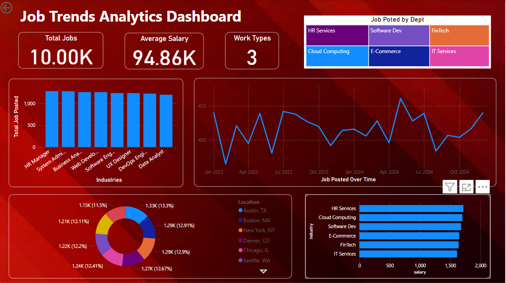

# 📊 Job Trends Analysis Dashboard - Power BI

This Power BI project analyzes job listings to uncover key trends in job titles, salaries, work types, skills, and locations.
It is designed to help job seekers, career advisors, and HR professionals make informed decisions based on real-world job market data.

---

## 📁 Dataset

- **Source**: Simulated dataset of 10,000 job listings
- **Fields**:
  - Job ID
  - Job Title
  - Company
  - Location (City, State)
  - Salary (USD)
  - Work Type (Remote, On-site, Hybrid)
  - Industry
  - Skills (comma-separated)
  - Post Date

*The dataset was generated to reflect realistic job market trends.*

---

## 📈 Dashboard Features

### ✅ KPI Cards
- Total Jobs Posted
- Average Salary
- % Remote Jobs

### ✅ Charts & Visuals
- **Bar Chart**: Top 10 Job Titles / Skills
- **Map**: Job listings by location
- **Donut Chart**: Work Type distribution
- **Line Chart**: Job postings trend over time
- **Treemap**: Jobs by Company or Industry

### ✅ Interactive Filters
- Industry
- Location
- Work Type
- Post Date
- Skills

---

## ⚙️ Power BI Techniques Used

- Power Query for data cleaning and transformation
- DAX measures for KPIs:
  - `Total Jobs = COUNT(Job ID)`
  - `Average Salary = AVERAGE(Salary (USD))`
  - `Remote % = ...` *(DAX formula included in the report)*
- Visual interactions and slicers for interactivity
- Custom formatting for improved UX

---

## 📝 Project Purpose

This project was created as a portfolio piece to showcase Power BI data analysis and dashboard design skills.
It simulates the kind of analysis that might be useful for career counseling centers, job boards, or labor market researchers.

---

## 📷 Dashboard Preview

---

## 🙋‍♂️ Author

Ahtram Anjum  
🔗 [LinkedIn](https://www.linkedin.com/in/ahtramanjum/)  
📧 ahtramanjum@gmail.com
